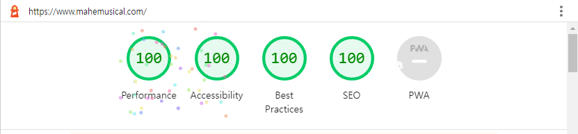

# MA:HE 뮤지컬 티켓팅 홍보 페이지✨

연세대학교 뮤지컬 소모임 ma:he 봄 공연 - 어쩌면 해피엔딩 홈페이지

## [**홈페이지 링크**](https://www.mahemusical.com/) - https://www.mahemusical.com/

  
포스터

  

---

## 🚕페이지와 📀기능
> 모든 기기 호환 가능한 완전 반응형 디자인

- 메인 페이지
  - ~~예쁘다~~  
  
- 공연 상세 페이지
  
- 예매 진행 페이지
  - 시간대, 좌석 종류, 티켓 종류에 따른 할인 적용하기
  
  - 예매 후 예매자에게 예매 정보에 관한 이메일 전송하기
  - 예매 후 예매 내역 페이지로 바로 이동 가능
    
- 예매 내역 확인 페이지
  - 이메일과 이름으로 확인 가능
  
  - 한 사람 계정으로 여러 티켓 발권시 페이지네이션 적용
  
- 관리자 페이지
  - 예매 및 결제 상태(5단계) 관리
  
  - 좌석 위치와 상태 관리  
  - 그외 기타 예매자 정보 확인 가능

- 마헤 이야기 페이지
  
- 커밍 순 페이지

## 💻기술적인 이야기

### 기술 스택
- `Next.js`
- `Typescript`
- `TailwindCSS`
- `Firebase`

### 프론트

- 달력 구현을 위해 `react-calendar`를 설치하여 요구 사항에 맞게 재구성
- 아이콘은 전통의 `react-icons`
- 폰트는 ~~내가 좋아하는~~ `Pretendard`
- 메인 페이지의 글은 `svg`로 구현
  - 폰트를 내려받아 글자를 쓰기엔 리소스가 커서 `svg`가 나을 거라 판단.
- 예매 진행 도중 자리가 나가면 다음 페이지 넘어가기 전 매진 알림 메시지를 띄움
- 이외에도 예매 진행 도중 예외 케이스 대처
  
### 백(파이어베이스)
- 서버리스 메일링을 위해 `Functions` 활용
- 관리자 페이지 계정을 위해 `Authentication` 활용
- 실시간 관객 수를 통한 예매 정보 업데이트를 위해 `Realtime DB` 사용
- 예매 데이터를 위해 `Firestore DB`를 활용해 데이터베이스 구조를 설계

### 기타 기술들

- 오류 감지를 위한 [Sentry](https://sentry.io/) 장착
- 구글 애널리틱스 장착

## 🗻마주쳤던 난관들

1. `react-calendar`의 디자인 한계
2. `toLocaleString`으로 인한 `ios, mac` 운영체제의 오류
3. 관리자 페이지에 사용된 `material-table`의 오래된 호환성

## 💯점수

~~와 confetti!~~

## 📣회고와 하고 싶은 말

나중에 블로그 게재 예정!!